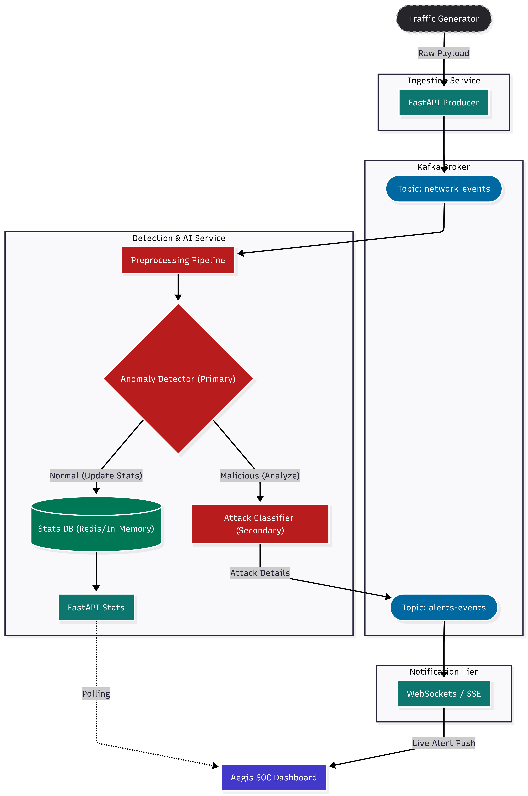

# End-to-End Network Detection and Response (NDR) Pipeline

A real-time Network Detection and Response MVP that ingests network traffic, streams it via Apache Kafka, and utilizes a Two-Stage Machine Learning pipeline to detect and classify cyber threats.

## Architecture

The system consists of three decoupled components:
1. **Traffic Generator:** Simulates real-time network flow by reading from the `UNSW-NB15` dataset and streaming JSON events to the Ingestion API.
2. **Ingestion Service (Port 8000):** A FastAPI microservice that receives network events and acts as a Kafka Producer, publishing them to the `network-events` topic.
3. **Detection Service (Port 8001):** A FastAPI microservice that acts as a Kafka Consumer. It processes incoming streams through a robust ML Pipeline:
   - **Stage 1 (Random Forest + SMOTE):** Binary classification (Normal vs. Attack).
   - **Stage 2 (Tuned XGBoost):** Multi-class categorization for threat specification and risk scoring.

## Prerequisites

- Python 3.11+
- Docker & Docker Compose (for Apache Kafka)
- [uv](https://github.com/astral-sh/uv) (Extremely fast Python package installer and resolver)

## Setup & Installation

The project uses a unified shell script to handle virtual environment creation and dependency installation for all independent services.

1. Clone the repository and navigate to the root directory.
2. Run the setup script:
   ```bash
   chmod +x setup.sh
   ./setup.sh
   ```
3. Activate the virtual environment:
   ```bash
   source ndr/bin/activate
   ```
## Model Artifacts Placement
Before running the application, ensure the pre-trained model artifacts are placed inside the `detection_service/models/ directory`:

   - `preprocessing_pipeline.joblib`

   - `stage1_random_forest_smote.joblib`

   - `stage2_xgboost_tuned.joblib`

   - `stage2_label_encoder.joblib`


## Running the Pipeline

A centralized development script manages the lifecycle of the entire pipeline, including Kafka containers and FastAPI endpoints.

Run the pipeline with a single command:
   ```bash
   chmod +x dev.sh
   ./dev.sh
   ```